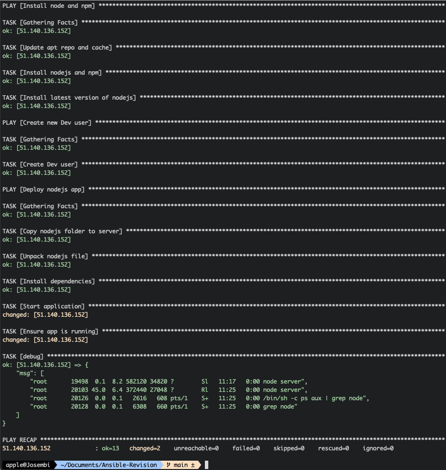

# App Deployment to Azure Using Ansible

## Introduction

Ansible is an open-source tool for orchestration, deployment, configuration, automation and management of IT infrastructure which I will be using to deploy a Nodejs App in Azure.

## Configuration

I will use my local dev environment as my **control node** where I'll execute Ansible playbooks and configure one of my **remote nodes** in Azure. I've created a resource group in Azure (**Ansible-VMs**) and instantiated two Virtual Machines (**Ansible-Replica-1 and Ansible-Replica-2**) which will be running in my VNet.


I will add the Public IPs to my **hosts** files and write the playbook.


## NodeJS end-to-end Deployment

I will start writing the playbook yaml file which will configure the remote server in Azure.

The first thing will be to install **nodejs** and node package manager **npm** in the remote.

```yaml
---
- name: Install node and npm
  hosts: 51.140.136.152  # Replica 2
  tasks:
    - name: Update apt repo and cache
      apt: update_cache=yes force_apt_get=yes cache_valid_time=3600
    - name: Install nodejs and npm
      apt:
        pkg:
          - nodejs
          - npm
    - name: Install latest version of nodejs
      apt:
        name: nodejs
        state: latest

```

Next I will build the app locally and an artifact archive will be created (nodejs-app-1.0.0.tgz). I will copy this archive to my home folder in the remote server and unpack it, subsequent to which I'll install dependencies which are in the unpacked **package** folder. Then I'll start the app.

```yaml
- name: Deploy nodejs app
  hosts: 51.140.136.152
  tasks:
    - name: Copy nodejs folder to server
      copy:
        src: /Users/apple/Documents/Ansible-Revision/node-app-master/nodejs-app-1.0.0.tgz
        dest: /home/josembi
    - name: Unpack nodejs file
      unarchive:
        src: /home/josembi/nodejs-app-1.0.0.tgz
        dest: /home/josembi
        remote_src: yes
    - name: Install dependencies
      npm:
        path: /home/josembi/package
    - name: Start application
      command:
        chdir: /home/josembi/package/app
        cmd: node server
      async: 1000
      poll: 0
```


Ansible has run successfully, updating, installing Nodejs and npm and finally deploying the app.

In the terminal window of the Azure webserver, I see that the server is running. I will add register and debug modules to my playbook to enable Ansible provide this information instead of logging in the remote server and checking that out.


```yaml
....*code truncated*....
    - name: Ensure app is running
      shell: ps aux | grep node
      register: app_status
    - debug: msg={{app_status.stdout_lines}}
```


The application is fully deployed, only a few tweaks and all should be working as desired.

## Create a Dev User 

I have been running the app as **josembi** with full admin privileges which may not be suitable for someone like a junior developer. Thus I have created a new user **Foo** with non root permissions to execute the deployment. Initially, the application will be run by an admin user as you can see in the **hosts** file, then a new user will be created and he will execute the rest of the configuration and deployment.

```yaml
---
- name: Install node and npm
  hosts: 51.140.136.152  # Replica 2
  tasks:
    - name: Update apt repo and cache
      apt: update_cache=yes force_apt_get=yes cache_valid_time=3600
    - name: Install nodejs and npm
      apt:
        pkg:
          - nodejs
          - npm
    - name: Install latest version of nodejs
      apt:
        name: nodejs
        state: latest

- name: Create new Dev user
  hosts: 51.140.136.152
  tasks:
    - name: Create Dev user
      user:
        name: foo
        comment: Foo Ansible User
        group: admin

- name: Deploy nodejs app
  hosts: 51.140.136.152
  become: True
  become_user:   # Privilege escalation from admin to dev
  tasks:
    - name: Copy nodejs folder to server
      copy:
        src: /Users/apple/Documents/Ansible-Revision/node-app-master/nodejs-app-1.0.0.tgz
        dest: /home/foo
    - name: Unpack nodejs file
      unarchive:
        src: /home/foo/nodejs-app-1.0.0.tgz
        dest: /home/foo
        remote_src: yes
    - name: Install dependencies
      npm:
        path: /home/foo/package
    - name: Start application
      command:
        chdir: /home/foo/package/app
        cmd: node server
      async: 1000
      poll: 0
    - name: Ensure app is running
      shell: ps aux | grep node
      register: app_status
    - debug: msg={{app_status.stdout_lines}}
```


